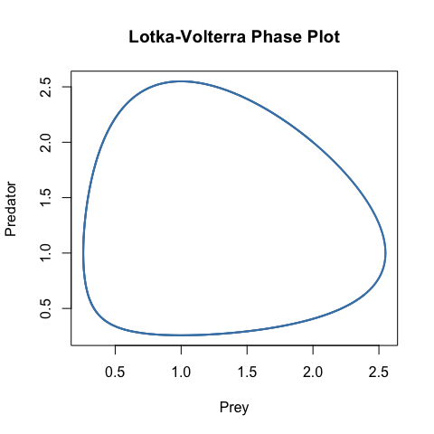
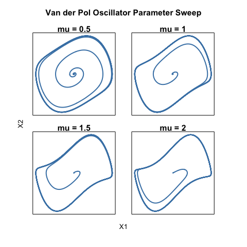

# odeintr
Timothy H. Keitt  
Feb 14, 2017  

[](https://www.r-pkg.org/badges/version/odeintr) [](https://cran.r-project.org/web/packages/odeintr/index.html) [](https://ci.appveyor.com/project/thk686/odeintr)
[](https://travis-ci.org/thk686/odeintr) 

The odeintr is package for integrating differential equations in R. The integration engine is
the [Boost odeint package](https://headmyshoulder.github.io/odeint-v2/).

### Features

1. Simple specification of the ODE system
1. Named, dynamic run-time setable system parameters
1. Intelligent defaults, easily overridden, used throughout
1. A wide range of integration methods available for compiled system (see [stepper types](https://www.boost.org/doc/libs/1_58_0/libs/numeric/odeint/doc/html/boost_numeric_odeint/odeint_in_detail/steppers.html#boost_numeric_odeint.odeint_in_detail.steppers.stepper_overview))
1. Fully automated compilation of ODE system specified in C++
1. ~~Simple openmp vectorization of large systems~~ (Broken in latest Boost release)
1. Results returned as a simple data frame ready for analysis and plotting
1. Ability to specify a custom observer in R that can return arbitrary data
1. Three options for calling the observer: at regular intervals, after each update step or at specified times
1. Ability to alter system state and restart simulations where you left off
1. Can compile an implicit solver with symbolic evaluation of the Jacobian
1. You can easily save and edit the generated C++ code

### Installation

```
install.packages(odeintr)                   # released
devtools::install_github("thk686/odeintr")  # development
```

### Examples


```r
library(odeintr)
dxdt = function(x, t) x * (1 - x)
system.time({x = integrate_sys(dxdt, 0.001, 15, 0.01)})
```

```
##    user  system elapsed 
##   0.107   0.005   0.112
```

```r
plot(x, type = "l", lwd = 3, col = "steelblue", main = "Logistic Growth")
```

<!-- -->

```r
compile_sys("logistic", "dxdt = x * (1 - x)")
system.time({x = logistic(0.001, 15, 0.01)})
```

```
##    user  system elapsed 
##       0       0       0
```

```r
plot(x, type = "l", lwd = "3", col = "steelblue", main = "Logistic Growth")
points(logistic_at(0.001, sort(runif(10, 0, 15)), 0.01), col = "darkred")
```

<!-- -->


```r
dxdt = function(x, t) c(x[1] - x[1] * x[2], x[1] * x[2] - x[2])
obs = function(x, t) c(Prey = x[1], Predator = x[2], Ratio = x[1] / x[2])
system.time({x = integrate_sys(dxdt, rep(2, 2), 20, 0.01, observer = obs)})
```

```
##    user  system elapsed 
##   0.170   0.007   0.177
```

```r
plot(x[, c(2, 3)], type = "l", lwd = 2, col = "steelblue", main = "Lotka-Volterra Phase Plot")
```

<!-- -->

```r
plot(x[, c(1, 4)], type = "l", lwd = 2, col = "steelblue", main = "Prey-Predator Ratio")
```

<!-- -->


```r
# C++ code
Lorenz.sys = '
  dxdt[0] = 10.0 * (x[1] - x[0]);
  dxdt[1] = 28.0 * x[0] - x[1] - x[0] * x[2];
  dxdt[2] = -8.0 / 3.0 * x[2] + x[0] * x[1];
  ' # Lorenz.sys
compile_sys("lorenz", Lorenz.sys)
system.time({x = lorenz(rep(1, 3), 100, 0.001)})
```

```
##    user  system elapsed 
##   0.022   0.003   0.024
```

```r
plot(x[, c(2, 4)], type = 'l', col = "steelblue", main = "Lorenz Attractor")
```

<!-- -->


```r
VdP.sys = '
dxdt[0] = x[1];
dxdt[1] = 2.0 * (1 - x[0] * x[0]) * x[1] - x[0];
' # Vdp.sys
compile_sys("vanderpol", VdP.sys, method = "bsd") # Bulirsch-Stoer
system.time({x = vanderpol(rep(1e-4, 2), 100, 0.01)})
```

```
##    user  system elapsed 
##   0.003   0.000   0.003
```

```r
par(mfrow = c(2, 2), mar = rep(0.5, 4), oma = rep(5, 4), xpd = NA)
make.plot = function(xy, xlab = NA, ylab = NA)
  plot(xy, col = "steelblue", lwd = 2, type = "l",
       axes = FALSE, xlab = xlab, ylab = ylab)
plot.new()
make.plot(x[, c(3, 1)]); axis(3); axis(4)
make.plot(x[, c(1, 2)], "Time", "X1"); axis(1); axis(2)
make.plot(x[, c(3, 2)], "X2"); axis(1); axis(4)
title(main = "Van der Pol Oscillator", outer = TRUE)
```

<!-- -->


```r
# Use a dynamic parameter
VdP.sys = '
dxdt[0] = x[1];
dxdt[1] = mu * (1 - x[0] * x[0]) * x[1] - x[0];
' # Vdp.sys
compile_sys("vpol2", VdP.sys, "mu", method = "bsd")
par(mfrow = c(2, 2), mar = rep(1, 4), oma = rep(3, 4), xpd = NA)
for (mu in seq(0.5, 2, len = 4))
{
  vpol2_set_params(mu = mu)
  x = vpol2(rep(1e-4, 2), 100, 0.01)
  make.plot(x[, 2:3]); box()
  title(paste("mu =", round(mu, 2)))
}
title("Van der Pol Oscillator Parameter Sweep", outer = TRUE)
title(xlab = "X1", ylab = "X2", line = 0, outer = TRUE)
```

<!-- -->


```r
# Stiff example from odeint docs
Stiff.sys = '
  dxdt[0] = -101.0 * x[0] - 100.0 * x[1];
  dxdt[1] = x[0];
' # Stiff.sys
cat(JacobianCpp(Stiff.sys))
```

```
## J(0, 0) = -101;
## J(0, 1) = -100;
## J(1, 0) = 1;
## J(1, 1) = 0;
## dfdt[0] = 0.0;
## dfdt[1] = 0.0;
```

```r
compile_implicit("stiff", Stiff.sys)
x = stiff(c(2, 1), 5, 0.001)
plot(x[, 1:2], type = "l", lwd = 2, col = "steelblue")
lines(x[, c(1, 3)], lwd = 2, col = "darkred")
```

<!-- -->

The example below is not working with the latest version of odeint that comes with the BH package. I've submitted and issue on github.


```r
# Robertson chemical kinetics problem
# Robertson = '
# dxdt[0] = -alpha * x[0] + beta * x[1] * x[2];
# dxdt[1] = alpha * x[0] - beta * x[1] * x[2] - gamma * x[1] * x[1];
# dxdt[2] = gamma * x[1] * x[1];
# ' # Robertson
# pars = c(alpha = 0.04, beta = 1e4, gamma = 3e7)
# init.cond = c(1, 0, 0)
# cat(JacobianCpp(Robertson))
# compile_implicit("robertson", Robertson, pars, TRUE)
# at = 10 ^ seq(-5, 5, len = 400)
# x = robertson_at(init.cond, at)
# par(mfrow = c(3, 1), mar = rep(0.5, 4), oma = rep(5, 4), xpd = NA)
# plot(x[, 1:2], type = "l", lwd = 3,
#      col = "steelblue", log = "x", axes = F, xlab = NA)
# axis(2); box()
# plot(x[, c(1, 3)], type = "l", lwd = 3,
#      col = "steelblue", log = "x", axes = F, xlab = NA)
# axis(4); box()
# plot(x[, c(1, 4)], type = "l", lwd = 3,
#      col = "steelblue", log = "x", axes = F)
# axis(2); axis(1); box()
```

It is important to understand that the only thing that ```odeintr``` does is to generate C++ code and compile it using Rcpp. That means you can use the generated code as a starting point for your project and modify as you wish.


```r
the_code = compile_sys("logitest", "dxdt = x * (1 - x)", compile = FALSE)
cat(the_code)
```

```
## // Copyright Timothy H. Keitt 2015
## // See license for odeintr package
## 
## // [[Rcpp::depends(odeintr)]]
## 
## #include <Rcpp.h>
## // [[Rcpp::plugins(cpp11)]]
## 
## // [[Rcpp::depends(BH)]]
## #include "boost/numeric/odeint.hpp"
## namespace odeint = boost::numeric::odeint;
## 
## ;
## 
## namespace odeintr
## {
##   static const std::size_t N = 1;
## 
##   typedef std::vector<double> state_type;
##   
##   static state_type state(N);
##   
##   typedef odeint::runge_kutta_dopri5<state_type> stepper_type;
##   
##   static auto stepper = odeint::make_dense_output(1e-06, 1e-06, stepper_type());
##   
##   typedef std::vector<double> vec_type;
##   static std::vector<vec_type> rec_x(N);
##   static vec_type rec_t;
##   
##   ;
##   
##   #include "utils.h"
##   
##   static void
##   sys(const state_type x, state_type &dxdt, const double t)
##   {
##     dxdt[0] = x[0] * (1 - x[0]);
##   }
## 
##   static void
##   obs(const state_type x, const double t)
##   {
##     for (int i = 0; i != N; ++i)
##       rec_x[i].push_back(x[i]);
##     rec_t.push_back(t);
##   }
##   
## }; // namespace odeintr
## 
## static void
## reserve(odeintr::vec_type::size_type n)
## {
##   odeintr::rec_t.reserve(n);
##   for (auto &i : odeintr::rec_x) i.reserve(n);
## }
## 
## // [[Rcpp::export]]
## Rcpp::List logitest_get_output()
## {
##   Rcpp::List out;
##   out("Time") = Rcpp::wrap(odeintr::rec_t);
##   for (int i = 0; i != odeintr::N; ++i)
##   {
##     auto cnam = std::string("X") + std::to_string(i + 1);
##     out(cnam) = Rcpp::wrap(odeintr::rec_x[i]);
##   }
##   out.attr("class") = "data.frame";
##   int rows_out = odeintr::rec_t.size();
##   auto rn = Rcpp::IntegerVector::create(NA_INTEGER, -rows_out);
##   out.attr("row.names") = rn;
##   return out;
## };
## 
## // [[Rcpp::export]]
## void logitest_set_state(Rcpp::NumericVector new_state)
## {
##   if (new_state.size() != odeintr::N)
##     Rcpp::stop("Invalid initial state");
##   std::copy(new_state.begin(),
##             new_state.end(),
##             odeintr::state.begin());
## }
## 
## // [[Rcpp::export]]
## std::vector<double>
## logitest_get_state()
## {
##   return odeintr::state;
## }
## 
## // [[Rcpp::export]]
## void logitest_reset_observer()
## {
##   for (auto &i : odeintr::rec_x) i.resize(0);
##   odeintr::rec_t.resize(0);  
## }
## 
## // [[Rcpp::export]]
## Rcpp::List logitest_adap(Rcpp::NumericVector init,
##                              double duration,
##                              double step_size = 1.0,
##                              double start = 0.0)
## {
##   logitest_set_state(init);
##   logitest_reset_observer(); reserve(duration / step_size);
##   odeint::integrate_adaptive(odeintr::stepper, odeintr::sys, odeintr::state,
##                              start, start + duration, step_size,
##                              odeintr::obs);
##   return logitest_get_output();
## }
## 
## // [[Rcpp::export]]
## Rcpp::List logitest_at(Rcpp::NumericVector init,
##                            std::vector<double> times,
##                            double step_size = 1.0,
##                            double start = 0.0)
## {
##   logitest_set_state(init);
##   logitest_reset_observer(); reserve(times.size());
##   odeint::integrate_const(odeintr::stepper, odeintr::sys, odeintr::state,
##                           start, times[0], step_size);
##   odeint::integrate_times(odeintr::stepper, odeintr::sys, odeintr::state,
##                           times.begin(), times.end(), step_size, odeintr::obs);
##   return logitest_get_output();
## }
## 
## // [[Rcpp::export]]
## Rcpp::List
## logitest_continue_at(std::vector<double> times, double step_size = 1.0)
## {
##   double start = odeintr::rec_t.back();
##   logitest_reset_observer(); reserve(odeintr::rec_t.size() + times.size());
##   odeint::integrate_const(odeintr::stepper, odeintr::sys, odeintr::state,
##                           start, times[0], step_size);
##   odeint::integrate_times(odeintr::stepper, odeintr::sys, odeintr::state,
##                           times.begin(), times.end(), step_size, odeintr::obs);
##   return logitest_get_output();
## }
## 
## // [[Rcpp::export]]
## Rcpp::List logitest(Rcpp::NumericVector init,
##                        double duration,
##                        double step_size = 1.0,
##                        double start = 0.0)
## {
##   logitest_set_state(init);
##   logitest_reset_observer(); reserve(duration / step_size);
##   odeint::integrate_const(odeintr::stepper, odeintr::sys, odeintr::state,
##                           start, start + duration, step_size,
##                           odeintr::obs);
##   return logitest_get_output();
## }
## 
## // [[Rcpp::export]]
## std::vector<double>
## logitest_no_record(Rcpp::NumericVector init,
##                        double duration,
##                        double step_size = 1.0,
##                        double start = 0.0)
## {
##   logitest_set_state(init);
##   odeint::integrate_adaptive(odeintr::stepper, odeintr::sys, odeintr::state,
##                              start, start + duration, step_size);
##   return logitest_get_state();
## }
## 
## ;
```

### Performance

Because ODEINT is a header-only library, the entire integration path is exposed to the compiler. That means your system functions can be inlined with the integration code, loops unrolled, etc. It will help if you enable optimization in your compiler. Use "-O3" with gcc. See the R documentation on the user Makevars file. (Odeintr now provides a convenient function to set the compiler optimization level.)

The Lorenz and Van der Pol examples above show about 10 million observer calls per second.

### To Do

1. ~~Add additional integration methods from odeint~~
1. ~~Extend customized observer to compiled code~~
1. ~~Allow user to set error tolerances in compiled code~~
1. ~~Allow user to set error tolerances for system defined in R~~
1. ~~Expose implicit solver methods~~
1. ~~Compute Jacobian symbolically~~
1. ~~Convenient dynamic parameter settings~~
1. ~~Install emitted function in a new environment~~
1. Add more control of openmp threading
1. Allow custom state type

Pull requests are welcome.

